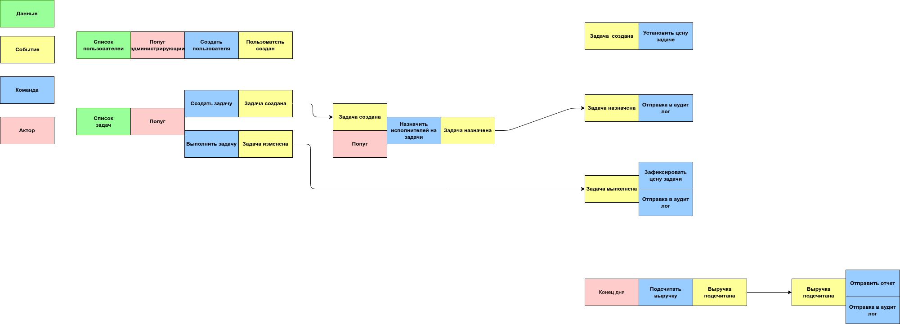

# Проект по курсу Асинхронная архитектура

---
# Описание событий

## Mutation

<details>

```yaml
- actor: popug
  data: name, roles, status [active, deactivated]  
  command: user.create
  event: user.created

- actor: popug 
  data: name, roles, status  [activate, deactivated]
  command: user.update
  event: user.updated
  comment: пользователя нельзя удалить, можно только деактивировать

- actor: popug
  data: title, description, status [in progress, done]
  command: task.create
  event: task.created

- actor: popug, event.user.updated, event.task.created
  data:
  command: task.assign
  event: task.assigned

- actor: popug
  data: id, title, assign
  command: task.update
  event: task.updated

- actor: task.updated
  data: id, assign, status
  command: task.update
  event: task.done

- actor: task.updated
  data: id, assign, status
  command: billing.task.done, billing.task.assign
  event:

- actor: schedule
  data:
  command: billing.close
  event: billing.closed
  comment: подситывается баланс за день и формируется начальный баланс следующего дня

- actor: billing.closed
  data: balance
  command: billing.open
  event:

- actor: billing.closed
  data: balance
  command: send.report
  event:
  comment: отправляет отчет руководство по итогам каждого дня

- actor: billing.closed
  data: balance
  command: send.audit
  event:
  comment: аудит-лог
```
</details>



### Event-command chains

[user.created, user.updated] -> task.assign

task.updated -> [billing.task.done, billing.task.assigned]

billing.closed -> [send.audit, send.report]

### Event context

```yaml
- id: user.created
  type: CUD
  producer: auth
  consumer: tasks, accounting
  data: id, name, roles

- id: user.updated
  type: CUD
  producer: auth
  consumer: tasks
  data: id, name, roles, status

- id: task.updated
  type: business
  producer: task
  consumer: accounting
  data: id, title, assign, isDone

- id: billing.closed
  type: business
  producer: accounting
  consumer: accounting (может быть отдельный сервис с отчетами)
```

## Query

```yaml
- id: tasks
  data: tasks list

- id: balance by popug
  data: balance

- id: audit log
  data: tasks id, tasks title

- id: total balance
  data: total, popug with negative balance count

- id: top task
  data: id, title, total
```

## Corner cases

Для точного подсчета задач в дне tasks посылает событие об окончании регистрации задач в отчетном периоде и номер последней задачи. 

Accounting ждет получения задачи с указанным ID. И после её обработки генерирует отчеты и закрывает отчетный период.