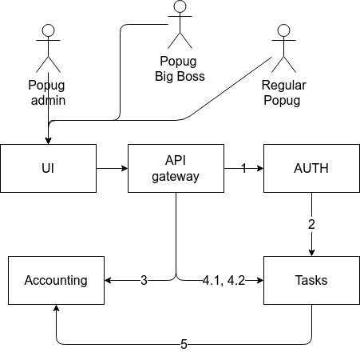

# PopugJIRA architecture

## Context diagram

### Auth

- авторизация
- ведение списка пользователей

### Tasks

- хранение задач
- назначение ответственных за задачи
- хранение состояния задачи

### Accounting

- подсчет выручки
- предоставление аналитических отчетов

### Описание связей

| Номер | Источник | Приемник | Тип связи | Описание |
| :---- | :------- | :------- | :-------- | :------- |
| 1     | UI | Auth | Синхронная | - Login - User create (user name / roles) - User delete - User update (name / roles) |
| 2     | Auth | Tasks | Синхронная| - User create (user name)  - User delete - User update (name /roles) |
| 3     | UI | Accounting | Синхронная | - Получение данных о прибыли (сумма) - Аналитика по задачам (самая дорогая задача / самая дешевая задача)  |
| 4.1     | UI | Tasks | Синхронная | - Создание задачи (name / description) - Команда "Назначить задачи" |
| 4.2     | Tasks | UI | Синхронная | - Список задач (name / description / assigned) |
| 5     | Tasks | Accounting | Асинхронная | - Назначение задачи (name, assigned) - Изменение статуса задачи (status) |

---

## Авторизация

Авторизация осуществляется на основе JWT-токенов. Подпись токена осуществляется алгоритмом RSA256. Каждый сервис в системе выполняет верификацию токена с помощью открытого ключа и извлекает из payload токена доступные пользователю роли.

## Временная недоступность сервисов

В случае потери сетевой связности должна наступать частичная деградация функциональности:
- нет доступа до `tasks`: отваливается список задач
- нет доступа до `accounting`: отваливается доступ до списка прибыли и аналитики

## Спорные места

- Функционал аналитики и подсчета выручки объеденены
- В kafka пишется не полное описание бизнес-события, а только необходимый минимум